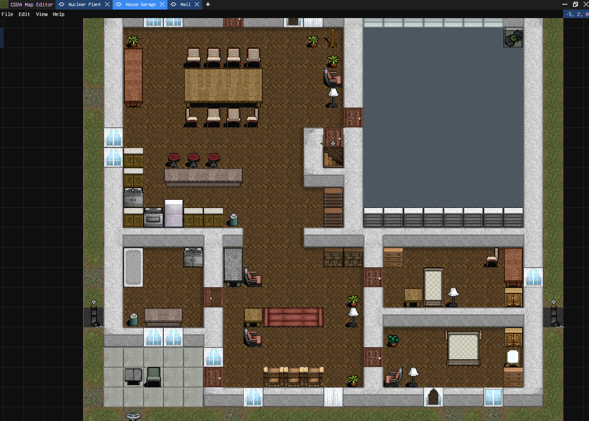

# CDDA Map Editor

The CDDA Map Editor is a map editor for the Open-Source
roguelike [Cataclysm: Dark Days Ahead](https://github.com/CleverRaven/Cataclysm-DDA/tree/master).
It allows you to edit the Maps in an easy-to-use interface and receive instant feedback
without having to reload the game or touch the underlying JSON Files.

If you prefer editing the Mapgen files directly, you can create a new __Mapgen Viewer__ Which will automatically reload
the selected map when you save the file.

> [!IMPORTANT]
> As of right now, this program only supports the Mapgen Viewer.
> The map editor has not been implemented and is currently in the works.
> If you still want to use a map editor,
> the best alternative as of right now is
> the [Hostile Architect](https://discourse.cataclysmdda.org/t/hostile-architect-location-builder-tool-extra-locations-mod/26351)
> Editor, which makes map editing easier, without having to read the CDDA Game directory.

## What can this Map Editor do?

### What is supported?

This editor currently supports the following mapgen file object properties including their `place` counterparts:

- terrain
- furniture
- monsters
- items
- nested
- toilets
- fields
- signs
- computers
- gaspumps
- traps
- vehicles

### What is not supported?

The following properties are not supported yet:

- monster
- npcs
- loot
- sealed_item
- rubble
- liquids
- corpses
- remove_vehicles
- graffiti

> [!IMPORTANT]
> Please keep in mind that the editor does not represent the map perfectly as it will be shown ingame.
> Always load your map in the actual game to check if it matches the map that is shown.
> If you find any inconsistencies, please head over to
> the [Issues](https://github.com/Karto1000/CDDA-Map-Editor-v2/issues) Page and submit a new issue after checking the
> [Known Problems](#known-problems).

### Known Problems

Here is a list of known limitations, which may or may not be fixed in the future.

- Vehicle Rotations beside 0, 90, 180 and 270 degrees look bad
- Damaged and Broken vehicles are not accurately spawned as they should be (With parts removed and disabled)
- Mutable overmap terrain entries are not supported
- Isometric tilesets are not supported

## Installation

### Prerequisites

To provide support for Palettes, Nested Mapgens and other related data, you will need to have a local copy /
installation of CDDA which will be read and parsed by the application.

### Downloads

Check out the [Releases](https://github.com/Karto1000/CDDA-Map-Editor-v2/releases) page to download the most recent
executable for your platform.

### Compiling

If you want to compile the program yourself, you can follow the steps below.

1. Install the required system dependencies for your Operating System outlined
   in https://v2.tauri.app/start/prerequisites/
2. Install Rust from [rust-lang.org](https://www.rust-lang.org/tools/install).
   This is used to run the Webview backend, which provides support for OS native operations such as Filesystem access.
3. Install Node.Js (LTS) from [nodejs.org](https://nodejs.org/en).
   This is used by the Webview frontend, which is powered by React.
4. Install the [Tauri CLI](https://v2.tauri.app/reference/cli/) using your preferred package manager
5. Finally, to build the application, run the `cargo tauri build` command in your terminal
6. The application should be located in the `src-tauri/target/release` directory